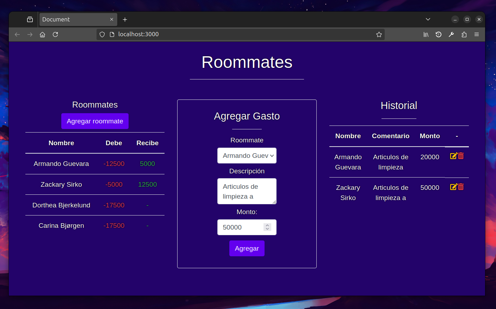

# Desafío Roommates

Es bien sabido que entre las mejores recomendaciones que un programador amateur puede
recibir para mejorar sus habilidades es “crear aplicaciones”, sin darle tanta importancia a la
temática a elaborar, sino que solo basta con un problema para desarrollar una solución digital.
En esta prueba deberás crear un servidor con Node que sirva una interfaz HTML que tendrás
a disposición en el Apoyo Desafío - Roommates y cuya temática está basada en el registro
de gastos entre roommates.

### Para inicializar el programa se requiere:

1. Instalar las dependencias usadas con el comando `npm i`.
2. Se requiere ejecutar el programa con el comando `npm run dev`.

- PROFE, HAY UN BUG QUE NO ME DIO TIEMPO DE ARREGLAR, CADA VEZ QUE AÑADO NUEVOS USUARIOS HAY QUE RECARGAR LA PAGINA.

Imagen de la aplicación:

## Josué Gallardo - g68 Bootcamp Talento Digital - Desafío Latam
